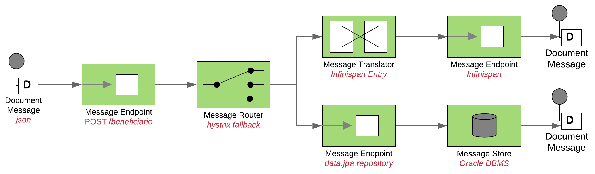
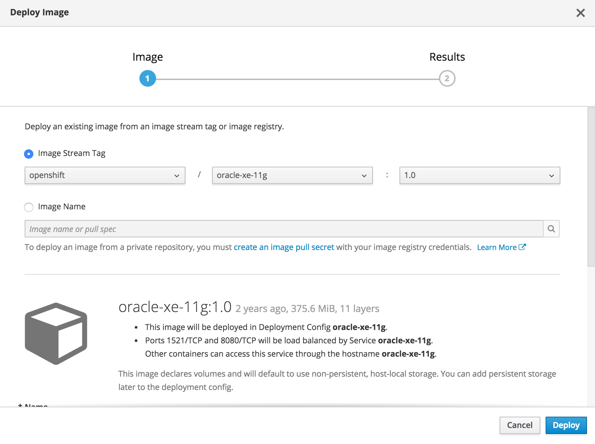

# BLUEPRINT.redhat
#### fuse-rest-infinispan-oracle

```
#fuse #camel #rest #infinispan #oracle #blueprint #redhat
```
#### ARCHITECTURAL REQUIREMENTS

- Expose REST endpoint w/ POST method;
- Filter by: cpf;
- Integrate w/ Infinispan configured with _nth_ minutes until cache expiration;
- Use Camel JavaDSL RouteBuilder class.



#### PRE-INSTALL REQUIREMENTS

1. Install FUSE _imagestreams_ and _templates_ 
2. Install CASSI custom template for this blueprint scenario
3. Install and enable a Red Hat Data Grid instance
4. If using a protected git source, you may also need to install a secret with the private key of git repository

#### OPENSHIFT INSTALLATION

```
mvn clean package

# execute this step only once per project
oc create secret generic github --from-file=ssh-privatekey=/Users/<USER>/.ssh/<MY-PRIVATE-GIT-SSH-KEY> --type=kubernetes.io/ssh-auth

# execute this step only once per project
oc secrets link builder github

# execute this step only once or if the custom template was modified
oc delete template s2i-cassi-fuse72-spring-boot-camel -n openshift
oc get template s2i-fuse72-spring-boot-camel -n openshift -o yaml > s2i-cassi-fuse72-spring-boot-camel.yaml
oc create -n openshift -f configuration/s2i-cassi-fuse72-spring-boot-camel.yaml

BLUEPRINT_PROJECT=blueprint
BLUEPRINT_APP=rest-jdg-app
BLUEPRINT_APP_GROUP=com.redhat.blueprint
BLUEPRINT_APP_GIT=git@github.com:<USER>/fuseRestJDGSpringBoot.git
BLUEPRINT_APP_REF=master

oc delete all -lapp=${BLUEPRINT_APP}
oc new-app --template=s2i-cassi-fuse72-spring-boot-camel --name=${BLUEPRINT_APP} \
--source-secret github \
--param GIT_REPO=${BLUEPRINT_APP_GIT} \
--param APP_NAME=${BLUEPRINT_APP} \
--param IMAGE_STREAM_NAMESPACE=openshift \
--param BUILD_SECRET=github \
--param GIT_REF=${BLUEPRINT_APP_REF} \
--param APP_GROUP=${BLUEPRINT_APP_GROUP}
```

PS. Params `source-secret` and `BUILD_SECRET` must be used only if your git repository is private.

###### TEST SERVICE ENDPOINT

```
oc get pod | grep ${BLUEPRINT_APP} | grep Running | awk '{ print $1 }'

curl -v -k -H "Content-Type: application/json" --data '{"cpf":"11111111111"}' -X POST "http://`oc get route ${BLUEPRINT_APP} --template {{.spec.host}}`/api/v1/beneficiario/"
```

###### SPRING-BOOT ACTUATOR ENDPOINTS

Documentation:<br>
https://docs.spring.io/spring-boot/docs/current/reference/htmlsingle/#production-ready

Enabled Endpoints:<br>

```
http://localhost:8081/health
http://localhost:8081/metrics
```

Openshift Application templates can be found at:<br>
https://github.com/jboss-fuse/application-templates/tree/master/quickstarts

This blueprint was made for use with FUSE7 _imagestream_:<br>
`application-templates-2.1.fuse-720018-redhat-00001`<br>
https://access.redhat.com/containers/?tab=security#/registry.access.redhat.com/fuse7/fuse-java-openshift/images/1.2-6.1547749162

A specific template was build for this blueprint at `./configuration/s2i-cassi-fuse72-spring-boot-camel.yaml`

#### ENVIRONMENT VARIABLES

###### SPRING-BOOT

| Name              | Default Value       | Description          |
|-------------------|---------------------|----------------------|
| `APP_NAME` | `rest-jdg-app` | Name of the spring-boot application |

###### INFINISPAN CACHE

| Name              | Default Value       | Description          |
|-------------------|---------------------|----------------------|
| `OPENSHIFT_INFINISPAN_SERVICE` | `datagrid-app-hotrod` | Infinispan service name |
| `OPENSHIFT_INFINISPAN_CACHE` | `default` | Infinispan cache name |
| `OPENSHIFT_INFINISPAN_HOST` | `127.0.0.1` | Infinispan host ip address |
| `OPENSHIFT_INFINISPAN_PORT` | `11222` | Infinispan service port |
| `OPENSHIFT_INFINISPAN_MAX_RETRIES` | `3` | Infinispan max-retries to acquire cache entry |
| `OPENSHIFT_INFINISPAN_ENTRY_LIFESPAN_TIME` | `20` | Infinispan entry lifespan unit |
| `OPENSHIFT_INFINISPAN_ENTRY_LIFESPAN_TIME_UNIT` | `MINUTES` | Infinispan entry lifespan time unit. Accepted values: HOURS, MINUTES |

###### ORACLE DATABASE

| Name              | Default Value       | Description          |
|-------------------|---------------------|----------------------|
| `OPENSHIFT_ORACLE_DATASOURCE_URL` | `` | Oracle Datasource URL e.g: jdbc:oracle:thin:@HOST:PORT:SID |
| `OPENSHIFT_ORACLE_DATASOURCE_USERNAME` | `` | Oracle Datasource username |
| `OPENSHIFT_ORACLE_DATASOURCE_PASSWORD` | `` | Oracle Datasource password |
| `OPENSHIFT_ORACLE_DATASOURCE_DRIVER` | `oracle.jdbc.driver.OracleDriver` | Oracle Datasource driver |
| `OPENSHIFT_ORACLE_SHOW_SQL` | `true` | Show SQL in console |
| `OPENSHIFT_ORACLE_DATASOURCE_DIALECT` | `org.hibernate.dialect.Oracle10gDialect` | Oracle Datasource Dialect |
| `OPENSHIFT_ORACLE_DATASOURCE_DDL_AUTO` | `validate` | Hibernate DDL-AUTO strategy: _validate_ , _create_ , _create-drop_ , _update_ |
| `OPENSHIFT_ORACLE_DATASOURCE_CONNECTION_TIMEOUT` | `30000` | Oracle Datasource connection timeout |
| `OPENSHIFT_ORACLE_DATASOURCE_CONNECTION_POOL` | `50` | Oracle Datasource connection pool |

The `OPENSHIFT_ORACLE_DATASOURCE_URL` can also work with the following template:<br>
`jdbc:oracle:thin:@(DESCRIPTION=(ADDRESS=(PROTOCOL=TCP)(HOST=172.30.137.245)(PORT=1521))(CONNECT_DATA=(SERVICE_NAME=xe)))`

#### STANDALONE LOCAL RUN

1- Download oracle-xe docker image

```
docker pull wnameless/oracle-xe-11g
```

2- Start oracle-xe docker

```
docker run -d -p 49161:1521 -e ORACLE_ALLOW_REMOTE=true wnameless/oracle-xe-11g
```
It will enable access through the following:

```
port: 49161<br>
sid: xe<br>
username: system<br>
password: oracle
```

PS. For this blueprint, we also provide more detail for creating another user schema.

You can download and build the oracle-xe docker image from here:

https://github.com/wnameless/docker-oracle-xe-11g or
https://github.com/andyrbell/oracle-xe-11g-centos

3- Start Red Hat JBoss Data Grid w/ port-offset equals to 100 (to not conflict w/ spring-boot)

```
./standalone.sh -Djboss.socket.binding.port-offset=100
```

4- Start the application

```
mvn spring-boot:run
```

PS. A valid Postman collection was created for use at `./documentation/blueprint.postman_collection.json`

###### CHECK IF DATABASE WAS CREATED

```
SELECT owner, table_name
     FROM all_tables where owner like 'CONVENIO';
   
SELECT * FROM CONVENIO.BENEFICIARIO;

-- insert a record for testing purposes.
INSERT INTO CONVENIO.BENEFICIARIO
  (handle,familia,nome,email,nu_cpf,nu_cartao,nu_contrato,dt_adesao) VALUES (
   CONVENIO.BENEFICIARIO_SEQ.nextVal,777,'raphael','rabreu@redhat.com','11111111111','10010','00001',sysdate);

COMMIT;
```

Open Postman and use the available collection at:
`documentation/poc.postman_collection.json`

The endpoint is located at:
`http://localhost:8080/api/v1/beneficiario-cache/1`

This endpoint will try to get the Entity<beneficiario> from cache.
If it exists, returns otherwise will call database and cache for create a new entry.

That will return a JSON response like:
```json
{
    "timestamp": {
        "year": 2019,
        "month": "FEBRUARY",
        "dayOfMonth": 11,
        "dayOfWeek": "MONDAY",
        "dayOfYear": 42,
        "monthValue": 2,
        "hour": 19,
        "minute": 12,
        "second": 17,
        "nano": 205000000,
        "chronology": {
            "id": "ISO",
            "calendarType": "iso8601"
        }
    },
    "httpStatus": 200,
    "message": "OK",
    "items": [
        {
            "handle": 1,
            "familia": 777,
            "nome": "raphael",
            "email": "rabreu@redhat.com",
            "cpf": "22222222222",
            "cartao": "100230",
            "contrato": "10000000001",
            "dataAdesao": 1549508938000
        }
    ]
}
```

### DOCUMENTATION

https://access.redhat.com/documentation/en-us/red_hat_fuse/7.2/html-single/deploying_into_spring_boot/
https://access.redhat.com/documentation/en-us/red_hat_fuse/7.2/html-single/fuse_on_openshift_guide/
https://access.redhat.com/documentation/en-us/red_hat_fuse/7.2/html-single/apache_camel_development_guide/

### RELEASE NOTES

#### 1.0.0
 - First Release
 
### LICENSE

Apache License Version 2.0

rabreu@redhat.com

### APPENDIX A
#### ORACLE USER (LOCAL ENVIRONMENT W/ DOCKER OR OPENSHIFT PORT-FORWARD)

Execute the attached SQL script: `./documentation/oracle-xe-blueprint.sql`

Now, you're able to use the following:

```
port: 1521<br>
sid: xe<br>
username: convenio<br>
password: convenio<br>
```

### APPENDIX B - ENVIRONMENT VARIABLES SETUP

In order to let the application communicate w/ infinispan and oracle _services_, you need to setup a _configmap_ or _environment variables_.

```
oc scale dc ${BLUEPRINT_APP} --replicas=0

oc set env dc/${BLUEPRINT_APP} OPENSHIFT_INFINISPAN_CACHE=default
oc set env dc/${BLUEPRINT_APP} OPENSHIFT_INFINISPAN_HOST=
oc set env dc/${BLUEPRINT_APP} OPENSHIFT_INFINISPAN_PORT=
oc set env dc/${BLUEPRINT_APP} OPENSHIFT_INFINISPAN_MAX_RETRIES=3
oc set env dc/${BLUEPRINT_APP} OPENSHIFT_INFINISPAN_ENTRY_LIFESPAN_TIME=5
oc set env dc/${BLUEPRINT_APP} OPENSHIFT_INFINISPAN_ENTRY_LIFESPAN_TIME_UNIT=MINUTES
oc set env dc/${BLUEPRINT_APP} OPENSHIFT_ORACLE_DATASOURCE_HOST=
oc set env dc/${BLUEPRINT_APP} OPENSHIFT_ORACLE_DATASOURCE_PORT=
oc set env dc/${BLUEPRINT_APP} OPENSHIFT_ORACLE_DATASOURCE_SID=
oc set env dc/${BLUEPRINT_APP} OPENSHIFT_ORACLE_DATASOURCE_USERNAME=
oc set env dc/${BLUEPRINT_APP} OPENSHIFT_ORACLE_DATASOURCE_PASSWORD=

oc scale dc ${BLUEPRINT_APP} --replicas=1  
```

### APPENDIX C - OPENSHIFT ORACLE PORT-FORWARDING (FOR LOCAL DEVELOPMENT ONLY)

In case you need access to the Oracle-XE POD outside Openshift, you'll need to enable port-forward on the container:

1- Deploy a oracle-xe image for tests.

You can pull a docker image in the openshift registry ou deploy directly via the openshift web console.



You can download and build the oracle-xe docker image from here:

https://github.com/wnameless/docker-oracle-xe-11g or
https://github.com/andyrbell/oracle-xe-11g-centos

2- Acquire the oracle-xe pod name

Once your oracle-xe is ready, get the name of the pod:

```
oc get pods | grep oracle
NAME                         READY     STATUS      RESTARTS   AGE
oracle-xe-11g-1-r42tx        1/1       Running     0          7m
```

3- Port-forward the 1521

Now, you'll need to port-forward to your local computer.

`oc port-forward oracle-xe-11g-1-r42tx 1521:1521`

PS. This operation will hang the console. All requests to `localhost:1521` will be forwarded to oracle-xe's openshift pod. 

4- Test the connection

Now you're able to connect in your local enviroment, like the following image:

<br>

<br>

References:

https://docs.openshift.com/container-platform/3.11/dev_guide/port_forwarding.html
https://blog.openshift.com/openshift-connecting-database-using-port-forwarding/
https://stackoverflow.com/questions/41338964/how-to-access-database-service-remotely-in-openshift-origin
http://www.mastertheboss.com/soa-cloud/openshift/accessing-openshift-services-remotely


